# NHS Chatbot (Gemini RAG)

Gemini-powered Retrieval-Augmented Generation (RAG) chatbot that answers medical questions by combining NHS PDF guidance, Pinecone for vector search, and a Flask frontend. The backend automatically cycles through a list of Gemini models (e.g., `gemini-pro`, `gemini-1.5-pro-latest`, `gemini-2.0-flash-exp`) to keep the chat experience smooth even when individual models hit quota limits.

---

## Features

- **Medical RAG** – LangChain pulls relevant NHS snippets from Pinecone before calling Gemini.
- **Automatic Gemini fallback** – rotates through several Gemini models and their `-latest` aliases when quotas or availability issues show up.
- **Source citations** – chatbot responses include a "Sources" block listing the documents used.
- **PDF ingestion** – hydrate Pinecone with local NHS PDFs using the provided embedding pipeline.
- **Web UI** – Bootstrap chat experience (`templates/chat.html`) with typing indicators and resilient error handling.

---

## Architecture

| Layer | Tech |
| --- | --- |
| Frontend | Flask + Bootstrap template (`templates/chat.html`, `static/style.css`) |
| Retrieval store | Pinecone serverless index (`medical-chatbot`, cosine, 384-dim) |
| Embeddings | `sentence-transformers/all-MiniLM-L6-v2` via `langchain-huggingface` |
| LLM | Google Gemini (via `langchain-google-genai` with realtime fallback) |
| Orchestration | LangChain RAG chain (`create_retrieval_chain`) |

---

## Diagrams

### System Architecture

```mermaid
flowchart TB
    subgraph Client["🖥️ Client Layer"]
        User["👤 User Browser"]
    end
    
    subgraph Web["🌐 Web Layer"]
        FlaskUI["📄 Flask Web UI\n(chat.html)"]
    end
    
    subgraph Backend["⚙️ Backend Layer"]
        FlaskApp["🐍 Flask Backend\n(app.py)"]
        RAG["🔗 LangChain RAG Chain"]
    end
    
    subgraph External["☁️ External Services"]
        Pinecone["🌲 Pinecone\nVector Store\n(medical-chatbot)"]
        Gemini["🤖 Google Gemini API\n(gemini-pro, gemini-1.5-pro...)"]
    end
    
    subgraph Embeddings["🧠 Embedding Layer"]
        HuggingFace["🤗 HuggingFace\nEmbeddings\n(MiniLM-L6-v2)"]
    end
    
    subgraph Data["📁 Data Layer"]
        PDFs["📚 NHS PDFs\n(data/)"]
    end
    
    User -->|"HTTP Request"| FlaskUI
    FlaskUI -->|"POST /get"| FlaskApp
    FlaskApp --> RAG
    RAG -->|"Query Embeddings"| HuggingFace
    HuggingFace -->|"Vector Search"| Pinecone
    Pinecone -->|"Retrieved Context"| RAG
    RAG -->|"Prompt + Context"| Gemini
    Gemini -->|"Generated Response"| RAG
    PDFs -->|"Ingestion"| HuggingFace
    HuggingFace -->|"Store Vectors"| Pinecone
```



### Activity Flow

```mermaid
flowchart TD
    A["👤 User enters medical question"] --> B["📨 Flask receives POST /get"]
    B --> C["🔢 Embed query\n(HuggingFace)"]
    C --> D["🔍 Search Pinecone\n(top-k chunks)"]
    D --> E["📝 Build prompt\nwith context"]
    E --> F["🤖 Call Gemini API"]
    F --> G{"⚠️ Quota\nexceeded?"}
    
    G -->|"Yes"| H["🔄 Fallback to\nnext Gemini model"]
    G -->|"No"| I["✅ Extract answer"]
    
    H --> F
    I --> J["📎 Append source\ncitations"]
    J --> K["📤 Return answer\nto UI"]
    
    style A fill:#e1f5fe
    style K fill:#c8e6c9
    style G fill:#fff3e0
    style H fill:#ffecb3
```



### Use Case Diagram

```mermaid
flowchart LR
    subgraph Actors["Actors"]
        User["👤 End User"]
        Admin["🔧 Administrator"]
        GeminiAPI["🤖 Gemini API"]
    end
    
    subgraph System["NHS Chatbot System"]
        UC1(("🗣️ Ask Medical\nQuestion"))
        UC2(("🔍 Retrieve Relevant\nContext"))
        UC3(("💬 Generate AI\nResponse"))
        UC4(("⚠️ Handle Quota\nErrors"))
        UC5(("📋 Display Answer\nwith Sources"))
        UC6(("📄 Ingest PDF\nDocuments"))
    end
    
    User --> UC1
    User --> UC5
    Admin --> UC6
    
    UC1 -.->|"<<include>>"| UC2
    UC2 -.->|"<<include>>"| UC3
    UC3 -.->|"<<extend>>"| UC4
    
    UC3 --> GeminiAPI
    UC4 --> GeminiAPI
    
    style UC1 fill:#bbdefb
    style UC2 fill:#c8e6c9
    style UC3 fill:#fff9c4
    style UC4 fill:#ffccbc
    style UC5 fill:#d1c4e9
    style UC6 fill:#f8bbd9
```



### Sequence Diagram


### Class Diagram


### Component Diagram

```mermaid
flowchart TB
    subgraph Frontend["🎨 Frontend Components"]
        HTML["chat.html\n(Bootstrap UI)"]
        CSS["style.css\n(Styling)"]
    end
    
    subgraph Backend["🔧 Backend Components"]
        App["app.py\n(Flask Server)"]
        Helper["helper.py\n(Utilities)"]
        PromptMod["prompt.py\n(System Prompt)"]
    end
    
    subgraph Ingestion["📥 Data Ingestion"]
        Store["store_index.py\n(PDF Processing)"]
        Data["data/\n(NHS PDFs)"]
    end
    
    subgraph External["☁️ External Services"]
        Pine["Pinecone\n(Vector DB)"]
        Gem["Google Gemini\n(LLM)"]
        HF["HuggingFace\n(Embeddings)"]
    end
    
    HTML --> App
    CSS --> HTML
    App --> Helper
    App --> PromptMod
    App --> Pine
    App --> Gem
    App --> HF
    
    Store --> Data
    Store --> Helper
    Store --> Pine
    Store --> HF
    
    style Frontend fill:#e3f2fd
    style Backend fill:#f3e5f5
    style Ingestion fill:#e8f5e9
    style External fill:#fff3e0
```



---

## Prerequisites

- Python **3.12**
- Access to Google AI Studio (Gemini API key + quota)
- Pinecone account (serverless index in `us-east-1`)
- `git`, `pip`, optional `conda`

---

## Quick Start

```bash
# 1. Clone
git clone https://github.com/erjanakmahato/nhs-chatbot.git
cd nhs-chatbot

# 2. Create & activate an environment (conda shown, use your preferred tool)
conda create -n nhs-chatbot python=3.12 -y
conda activate nhs-chatbot

# 3. Install dependencies
pip install -r requirements.txt
```

### Configure environment variables

Create `.env` in the project root:

```ini
PINECONE_API_KEY=your_pinecone_key
GOOGLE_API_KEY=your_gemini_key
# Optional: force a specific model; otherwise the app rotates through defaults
GEMINI_MODEL=gemini-pro
```

> The app automatically tries `gemini-pro`, `gemini-1.5-pro[-latest]`, `gemini-1.5-flash[-latest]`, `gemini-2.0-flash-exp`, and `gemini-3-pro-preview`. Set `GEMINI_MODEL` only when you need to pin a specific model.

---

## Populate Pinecone

### 1. Load NHS PDFs
1. Drop your NHS PDFs into `data/` (the repo ships with `Medical_book.pdf` as an example).
2. Run the ingestion script to split, embed, and upsert into Pinecone:

```bash
python store_index.py
```

## Run the chatbot

```bash
python app.py
```

Visit `http://localhost:8080` and start chatting. The Flask logs show which Gemini model is active, retrieved context length, and any fallback activity.

---

## Troubleshooting

| Issue | Fix |
| --- | --- |
| `ValueError: PINECONE_API_KEY...` | Ensure `.env` is created and the terminal session was restarted so `python-dotenv` can read it. |
| Pinecone `Index not found` | Run `python store_index.py`; the script creates `medical-chatbot` automatically if missing. |
| Gemini `ResourceExhausted / 429` | The app backs off, then automatically switches to the next Gemini model. If every model shows `limit: 0`, enable billing or request more quota in Google AI Studio. |
| `models/<name> is not found for API version v1beta` | Google occasionally renames models with `-latest`. The app now tries both variants automatically; adjust `GEMINI_MODEL` only if necessary. |
| Responses lack detail | Ensure your PDFs contain the info you need and consider increasing `search_kwargs={"k": 5}` in `app.py`. |

---

## Reference commands

| Purpose | Command |
| --- | --- |
| Install deps | `pip install -r requirements.txt` |
| Rebuild Pinecone index from PDFs | `python store_index.py` |
| Start web app | `python app.py` |

---

## Repository layout (partial)

```
├── app.py                # Flask entry point + Gemini fallback logic
├── store_index.py        # PDF ingestion → Pinecone
├── src/
│   ├── helper.py         # loaders, splitters, embeddings
│   └── prompt.py         # system prompt
├── templates/
│   └── chat.html         # Bootstrap chat UI
├── static/
│   └── style.css
└── data/
    └── Medical_book.pdf
```

---

## License

See [LICENSE](LICENSE) for details.

---

## Function Reference

| File | Function | Purpose |
| --- | --- | --- |
| `app.py` | `_format_source_label(metadata)` | Formats readable labels for cited documents. |
| `app.py` | `_build_sources_block(context_value)` | Builds the markdown “Sources” section appended to responses. |
| `app.py` | `list_available_models()` | Lists Gemini models accessible via the API key. |
| `app.py` | `test_model_with_google_genai(model_name)` | Verifies a Gemini model via the official SDK. |
| `app.py` | `test_model(model_instance, model_name)` | Validates a LangChain Gemini instance with timeout + quota handling. |
| `app.py` | `expand_model_variants(model_name)` | Generates canonical + `-latest` variants for Gemini model names. |
| `app.py` | `initialize_model(start_index=0)` | Iterates through candidate models and initializes the first viable one. |
| `app.py` | `rebuild_rag_chain()` | Recreates the LangChain retrieval chain after model switches. |
| `app.py` | `try_fallback_model(reason)` | Attempts to switch to the next Gemini model when quota/404 errors occur. |
| `app.py` | `index()` | Serves the chat UI (`GET /`). |
| `app.py` | `chat()` | Main chat endpoint (`POST /get`) with retry, fallback, and error handling. |
| `store_index.py` | `load_pdf_file(data)` | Loads PDFs from the `data/` directory. |
| `store_index.py` | `filter_to_minimal_docs(docs)` | Normalizes document metadata before chunking. |
| `store_index.py` | `text_split(extracted_data)` | Splits documents into overlapping chunks. |
| `store_index.py` | `download_hugging_face_embeddings()` | Returns the MiniLM embedding model. |
| `store_index.py` | (script body) | Uploads embedded chunks into the Pinecone index. |
